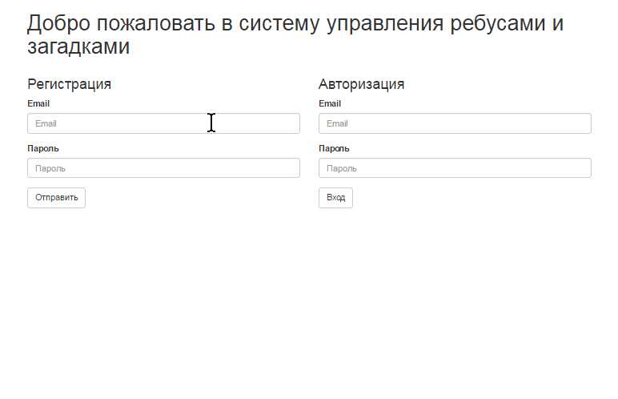

# Riddles-And-Puzzles

## Структура проекта
- `doc` - Документация
- `schemas` - Скрипты SQL
- `src/main` - Исходный код прилодения
- `src/test` - Скрипты для тестирования

## Changelog

### Версия 0.0.0.3

ТЗ Реализовано на 95%.
Осталось:

- реализовать страницу "Рейтинг отгадчиков";
- реализовать загрузку картинки для загадки;
- дополнить Javadoc;
- разрабораться почему падает MySQL после ~15 ребилдов.

Демонстрация работы:
